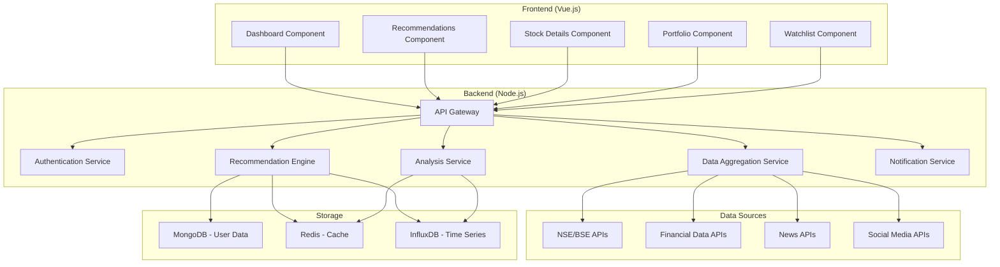

# Design Document

## Overview

The Indian Stock Predictor is a full-stack web application built with Vue.js frontend and Node.js backend, designed to provide comprehensive stock analysis and predictions for the Indian market. The system integrates multiple data sources, performs real-time analysis, and delivers personalized recommendations across different investment time horizons.

## Architecture

### High-Level Architecture



### Technology Stack

**Frontend:**
- Vue.js 3 with Composition API
- Vuex for state management
- Vue Router for navigation
- Chart.js for financial charts
- Tailwind CSS for styling
- Socket.io-client for real-time updates

**Backend:**
- Node.js with Express.js
- Socket.io for real-time communication
- JWT for authentication
- Bull Queue for background jobs
- Mongoose for MongoDB ODM

**Databases:**
- MongoDB for user data, portfolios, watchlists
- Redis for caching and session management
- InfluxDB for time-series stock data

**External APIs:**
- Yahoo Finance API (Primary) - Free real-time and historical data
- Alpha Vantage API (Secondary) - Free tier for fundamental data backup
- Twelve Data API (Tertiary) - Additional data source fallback
- NewsAPI for financial news
- Twitter API for sentiment analysis

## Components and Interfaces

### Frontend Components

#### 1. Dashboard Component
- **Purpose**: Main landing page showing overview of all recommendations
- **Props**: User preferences, market status
- **State**: Current recommendations, market indices, trending stocks
- **Methods**: `fetchDashboardData()`, `refreshRecommendations()`

#### 2. Recommendations Component
- **Purpose**: Display time-specific stock recommendations
- **Props**: Time horizon (daily/weekly/monthly/yearly)
- **State**: Filtered recommendations, loading states
- **Methods**: `filterByTimeHorizon()`, `sortByConfidence()`

#### 3. Stock Details Component
- **Purpose**: Detailed analysis view for individual stocks
- **Props**: Stock symbol, analysis type
- **State**: Stock data, charts, news, analysis results
- **Methods**: `fetchStockDetails()`, `updateCharts()`, `loadNews()`

#### 4. Portfolio Component
- **Purpose**: User's portfolio tracking and management
- **Props**: User ID
- **State**: Holdings, P&L, performance metrics
- **Methods**: `calculatePortfolioValue()`, `updateHoldings()`

### Backend Services

#### 1. API Gateway
```javascript
// Main routes structure
app.use('/api/auth', authRoutes);
app.use('/api/recommendations', recommendationRoutes);
app.use('/api/stocks', stockRoutes);
app.use('/api/portfolio', portfolioRoutes);
app.use('/api/watchlist', watchlistRoutes);
```

#### 2. Recommendation Engine
```javascript
class RecommendationEngine {
  async generateDailyRecommendations() {
    // Technical analysis for day trading
    // Volume analysis, momentum indicators
    // News sentiment impact
  }
  
  async generateWeeklyRecommendations() {
    // Swing trading patterns
    // Earnings calendar analysis
    // Sector rotation trends
  }
  
  async generateLongTermRecommendations() {
    // Fundamental analysis
    // Growth prospects, valuation metrics
    // Industry analysis
  }
}
```

#### 3. Data Aggregation Service
```javascript
class DataAggregator {
  async fetchLiveData() {
    // Real-time price updates
    // Volume and market depth
  }
  
  async fetchNewsData() {
    // Financial news aggregation
    // Sentiment analysis processing
  }
  
  async fetchFinancialData() {
    // Quarterly results, annual reports
    // Financial ratios calculation
  }
}
```

#### 4. Analysis Service
```javascript
class AnalysisService {
  async performTechnicalAnalysis(symbol) {
    // RSI, MACD, Moving Averages
    // Support/Resistance levels
    // Chart pattern recognition
  }
  
  async performFundamentalAnalysis(symbol) {
    // P/E, P/B, Debt-to-Equity ratios
    // Revenue growth, profit margins
    // Peer comparison
  }
  
  async performSentimentAnalysis(symbol) {
    // News sentiment scoring
    // Social media mentions analysis
    // Market sentiment indicators
  }
}
```

## Data Models

### User Model
```javascript
const userSchema = {
  _id: ObjectId,
  email: String,
  password: String, // hashed
  profile: {
    name: String,
    investmentExperience: String, // beginner/intermediate/expert
    riskTolerance: String, // low/medium/high
    preferredTimeHorizon: [String] // daily/weekly/monthly/yearly
  },
  preferences: {
    sectors: [String],
    maxInvestmentAmount: Number,
    notifications: {
      email: Boolean,
      push: Boolean
    }
  },
  createdAt: Date,
  lastLogin: Date
}
```

### Stock Model
```javascript
const stockSchema = {
  symbol: String,
  name: String,
  sector: String,
  currentPrice: Number,
  priceChange: Number,
  priceChangePercent: Number,
  volume: Number,
  marketCap: Number,
  technicalIndicators: {
    rsi: Number,
    macd: Number,
    movingAverage50: Number,
    movingAverage200: Number
  },
  fundamentalData: {
    peRatio: Number,
    pbRatio: Number,
    debtToEquity: Number,
    roe: Number,
    eps: Number
  },
  lastUpdated: Date
}
```

### Recommendation Model
```javascript
const recommendationSchema = {
  _id: ObjectId,
  symbol: String,
  timeHorizon: String, // daily/weekly/monthly/yearly
  action: String, // buy/sell/hold
  confidenceScore: Number, // 0-100
  targetPrice: Number,
  stopLoss: Number,
  reasoning: {
    technical: String,
    fundamental: String,
    sentiment: String
  },
  riskLevel: String, // low/medium/high
  createdAt: Date,
  validUntil: Date
}
```

### Portfolio Model
```javascript
const portfolioSchema = {
  userId: ObjectId,
  holdings: [{
    symbol: String,
    quantity: Number,
    averagePrice: Number,
    currentValue: Number,
    unrealizedPnL: Number
  }],
  totalValue: Number,
  totalInvestment: Number,
  totalPnL: Number,
  lastUpdated: Date
}
```

## Error Handling

### Frontend Error Handling
```javascript
// Global error handler for API calls
const apiErrorHandler = {
  handleNetworkError: (error) => {
    // Show offline message, cache data
  },
  handleAuthError: (error) => {
    // Redirect to login, clear tokens
  },
  handleDataError: (error) => {
    // Show fallback data, retry mechanism
  }
}
```

### Backend Error Handling
```javascript
// Centralized error middleware
const errorHandler = (err, req, res, next) => {
  const statusCode = err.statusCode || 500;
  const message = err.message || 'Internal Server Error';
  
  // Log error for monitoring
  logger.error({
    error: err,
    request: req.url,
    method: req.method,
    timestamp: new Date()
  });
  
  res.status(statusCode).json({
    success: false,
    message,
    ...(process.env.NODE_ENV === 'development' && { stack: err.stack })
  });
};
```

### Data Source Fallbacks
- Primary: Yahoo Finance API (free, reliable)
- Secondary: Alpha Vantage API (fundamental data)
- Tertiary: Twelve Data API (additional coverage)
- Quaternary: Cached data with staleness indicators
- Emergency: Static market closure message

## Testing Strategy

### Frontend Testing
```javascript
// Component testing with Vue Test Utils
describe('RecommendationsComponent', () => {
  test('displays daily recommendations correctly', async () => {
    // Mock API response
    // Mount component
    // Assert rendered content
  });
  
  test('handles loading states properly', () => {
    // Test loading indicators
    // Test error states
  });
});
```

### Backend Testing
```javascript
// API endpoint testing
describe('Recommendations API', () => {
  test('GET /api/recommendations/daily returns valid data', async () => {
    const response = await request(app)
      .get('/api/recommendations/daily')
      .expect(200);
    
    expect(response.body.recommendations).toBeDefined();
    expect(response.body.recommendations.length).toBeGreaterThan(0);
  });
});

// Service testing
describe('RecommendationEngine', () => {
  test('generates daily recommendations with proper confidence scores', async () => {
    const recommendations = await engine.generateDailyRecommendations();
    recommendations.forEach(rec => {
      expect(rec.confidenceScore).toBeGreaterThanOrEqual(0);
      expect(rec.confidenceScore).toBeLessThanOrEqual(100);
    });
  });
});
```

### Integration Testing
- End-to-end user flows with Cypress
- API integration tests with real data sources
- Performance testing for real-time data updates
- Load testing for concurrent users

### Data Quality Testing
- Validate data accuracy against multiple sources
- Test data freshness and update frequencies
- Verify calculation accuracy for technical indicators
- Test recommendation logic with historical data

## Performance Considerations

### Caching Strategy
- Redis for frequently accessed stock data (5-minute TTL)
- Browser caching for static assets
- CDN for chart images and historical data

### Real-time Updates
- WebSocket connections for live price updates
- Throttled updates to prevent UI flooding
- Selective updates based on user's active view

### Database Optimization
- Indexed queries on stock symbols and timestamps
- Aggregation pipelines for portfolio calculations
- Time-series optimization for historical data

### Scalability
- Horizontal scaling with load balancers
- Microservices architecture for independent scaling
- Queue-based processing for heavy analysis tasks